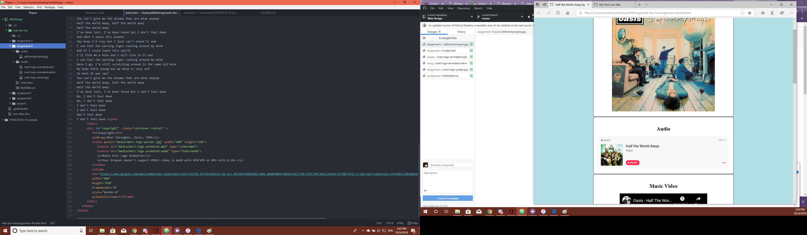

<h1>Technical Report</h1>
 
<h2>Assignment 4</h2>

<h3> [Live Sketch Link] (https://yewtreedesign.github.io/web-dev-hw/assignment-4) </h3>
 

 <h4>A.) Briefly describe the difference between divs, classes, ids, and spans</h4>

 The differences are that divs are block elements, used for styling in the HTML5 with out creating a separate Custom Style Sheet (CSS).
 Spans name Div elements.
 Ids are used to fill in details with in the Div.
 
 <h4>B.) What is "alt text," and why do we use it?</h4>
 
 Alt is used to give a description of an image, incase if the image isn't showing up on the browser or for the visually impaired.
 
 <h4>C.) Summarize your work cycle for this assignment</h4>
   All I have done was followed the instructions provided on the Moodle, I used iFrame and Source elements to represent the media on the page.
I can't wait till we start doing CSS so the code wouldn't be so congested with a lot of Div element.
 I couldn't get a free/safe copy of the song so I just shared the song from my iTunes... It only previews  
1:30 of it.
 

