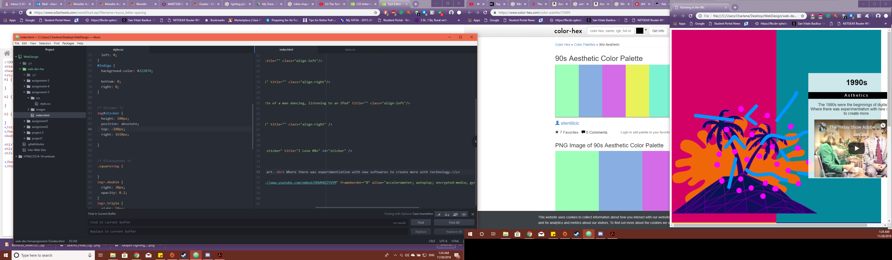

<h1>TECHNICAL REPORT</h1>

<h2> Assignment 5 </h2>

<h3> [Live Sketch Link] (https://yewtreedesign.github.io/web-dev-hw/assignment-5) </h3>

B.) Briefly share your design research for this assignment. What graphic or graphics did you choose, from what decade? How did you try to style your "art page" to reflect your exploration of this decade's design trends?
  
<i><b> There was certainly a lot of loud, bright, and contrasting designs in the 90s weren't there? There was also more experimentation implemented in design as well. Photoshop was released in the 90s and it driven people to experiment more with the available technology. The style I put into the page is also what I had done, experiment. I also included some png. files included in the folder relating to the 90s. Then as well bright contrasting colors you would see more in the 90s. Like bright magentas, teals, chrome yellows and indigos. I also added more of a web 2.0 feel, where you are viewing things through a small resolution. If you seen the Brandon Frasier website, you'll know what I mean.</i></b>
  
C.) Describe your color palette, including the 3 colors you chose. List their color names, rgb values, or hex codes.
  
<i><b> I have used:</i></b>
<ul>
  <li>Kaycee Orange #FFBB11</li>
  <li>Sweet Drama #D30166</li>
  <li>Stardoll Bitch #05889A</li>
  <li>Nuit #222074</li>
  </ul>
    
D.) Summarize your work cycle for this assignment. Review this page if you need some ideas.
 
<b><i> I have referenced the "I love the 2000s" example and I tried to implement my own mix of it and I tried to move the png files to try to make an abstract website. I think it worked. I also tried to morph to color blocks so that they are in columns... It sort of worked.

E.) Embed a screenshot of your workspace at some point during your development cycle.
 

