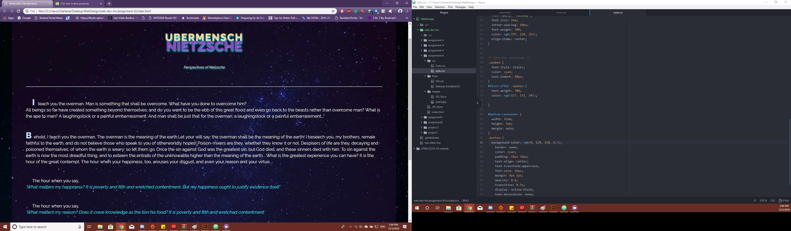

<h1>TECHNICAL REPORT<h1>
 
<h2>Charlene Mundel</h2>
 
LIVE LINK [https://yewtreedesign.github.io/web-dev-hw/assignment-6]

B.) Briefly share your design process for this assignment. What fonts did you choose, and why? 

<b> I was experimenting more with the lay out of the type faces and other effects I could add to the mix. 
I also used Railway and Arial fonts because they are easier to read on a web page.</b>
 
 

C.) What is the difference between a system font, web font, and web-safe font? What is the importance of having fallback fonts or a font stack? 

<b> system fonts are from your computer, web fonts can also be on a computer but it's also streamlined on the internet, Web-safe fonts are preloaded fonts included  
with in many OS. The importance of having the fall back fonts are just incase if one of your fonts fail due to a connection issue, you would still be able to Read
the content</b>
 
 

D.) Summarize your work cycle for this assignment. Review this page if you need some ideas. 

    <b>I have played around with how the title is layed out. I also added a glow to the text.
    What I tried to do is have the U and the H huge but I found that a little tricky to do. I am content with how it turned out.</b>
 
 
E.) Embed a screenshot of your workspace at some point during your development cycle.

 

