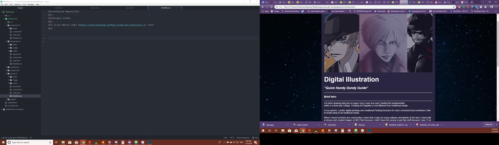

<h1>Technical Report</h1>
 
<h2>Project 2</h2>

<h3> [Live Sketch Link] (https://yewtreedesign.github.io/web-dev-hw/project-2) </h3>
 

A: What was difficult was to make some divs to take effect on the body of text, in the end I managed to get it to work.
 
B:Yeah, how some element can work hand in hand with other elements...Just remember to close them properly.
 
C: Well by following the instructions, I reused the code in assignment 4 and I flushed it out a bit more.

