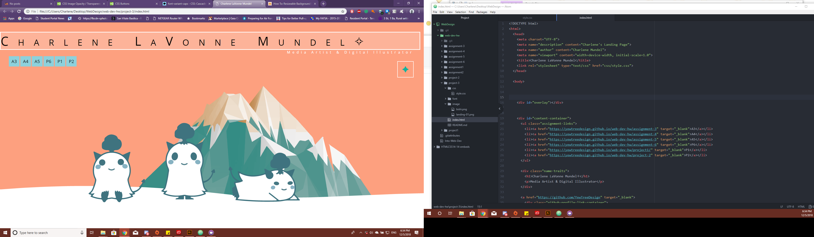

<h1>TECHNICAL REPORT</h1> 
<h2>Charlene LaVonne Mundel</h2> 
LIVE LINK [https://yewtreedesign.github.io/web-dev-hw/project-3]

B.) What is the difference between padding, margin, and borders?
 
<b> Padding goes all over your content. Margin is what's between the border and next elements, also the space outside of the border 
border is what's around the padding and content </b>
 

C.) What was the hardest task for you to accomplish this assignment? For example, was it overlapping elements, working with sizing, creating layout, or something else entirely?
 
<b>Trying to get things lining up the way I wanted. First was adjusting the background image. I went ahead and checked what the example did because I thought
stretching the image would do the job...I was wrong. I spent most of my time adjusting the image manually.</b>
 
D.) Summarize your work cycle for this assignment. Review this page if you need some ideas.
 
<b>I first started off the layout of the text and the content. I played around with some type faces and I wounded up using small caps 
I wanted the box to frame the landing page. I made the image so it can be adjusted by the size of the browser window.
</b>
 
E.) Embed a screenshot of your workspace at some point during your development cycle.
 

