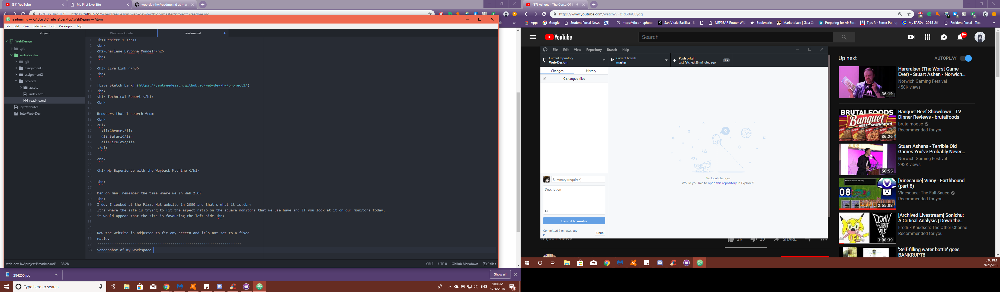

<h1>Project 1 </h1>
 
<h2>Charlene LaVonne Mundel</h2>
 

<h3> Live Link </h3>
 

[Live Sketch Link] (https://yewtreedesign.github.io/web-dev-hw/project1/)
 
<h1> Technical Report </h1>
 

Browsers that I search from
 
<ul>
  <li>Chrome</li>
  <li>Safari</li>
  <li>Firefox</li>
</ul>

 

<h1> My Experience with the Wayback Machine </h1>

 

Man oh man, remember the time where we in Web 2.0?
 
I do, I looked at the Pizza Hut website in 2000 and that's what it is. 
It's where the site is trying to fit the aspect ratio on the square monitors that we use have and if you look at it on our monitors today,
it would appear that the site is favouring the left side. 

Now the website is adjusted to fit any screen and it's not set to a fixed
ratio.
***************************
Screenshot of my workspace.

